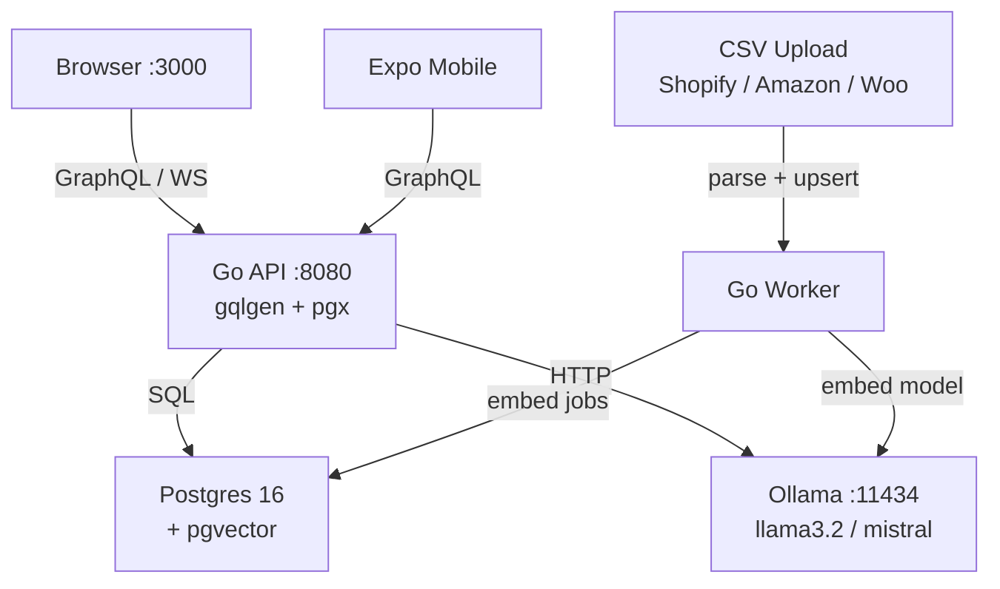

# Cartograph
> Local-first AI e-commerce analytics. Your data never leaves your machine.

## Quick start (2 minutes)

```bash
git clone https://github.com/<you>/cartograph && cd cartograph/cartography_code
docker compose -f deploy/docker-compose.yml up
# open http://localhost:3000
# drag sample-data/shopify_orders.csv onto the import panel
```

## Features

- **Analytics dashboard** — revenue, AOV, cohort retention, dead stock, inventory velocity
- **AI narrative** — grounded insights, zero hallucinated numbers (V3: only pre-computed metrics passed to LLM)
- **Text-to-SQL chat** — safe read-only queries, 6-layer guardrail suite
- **Content studio** — product descriptions, SEO copy, email campaigns
- **Semantic product search** — pgvector + HNSW index via `nomic-embed-text` embeddings
- **Expo mobile dashboard** — React Native metrics + charts
- **Multi-platform import** — Shopify, Amazon, WooCommerce CSV

## Architecture



## Stack

| Layer | Tech |
|---|---|
| API | Go 1.22 · gqlgen · pgx/v5 |
| LLM | Ollama (llama3.2) — fully local |
| Database | Postgres 16 + pgvector + pg_trgm |
| Web | Next.js 14 (App Router) · Tailwind · urql |
| Mobile | Expo SDK 56 · victory-native |
| Monorepo | Turborepo + pnpm workspaces |
| Infra | Docker Compose — single `up` to run everything |

## Security: Text-to-SQL

LLM proposes, deterministic Go disposes.

```
Layer 1: keyword blocklist        — rejects INSERT/UPDATE/DELETE/DROP/…
Layer 2: pg_query AST parse       — rejects malformed SQL
Layer 3: single SELECT only       — rejects multi-statement
Layer 4: allow-list tables        — rejects access to system tables
Layer 5: LIMIT injection          — caps result set at 500 rows
Layer 6: read-only Postgres role  — cartograph_chat user: SELECT only, no writes physically possible
```

Full test suite: 20+ malicious inputs, all blocked. See [`services/api/internal/ai/sql_test.go`](services/api/internal/ai/sql_test.go).

## Invariants

```
V1: ∀ SQL from LLM → guardrail.Validate() before execution
V2: text-to-SQL role = cartograph_chat (read-only, no writes physically possible)
V3: narrative → metrics JSON only passed, no raw rows
V4: email → SHA-256 hashed at parse time, plain text never stored
V5: import idempotent → upsert by external_id, no double-count on re-upload
V6: LLM unavailable → dashboard still renders (AI features degrade gracefully)
V7: ∀ metric computation → SQL/Go, never LLM
```

## Running tests

```bash
# Go — ingest parsers + analytics + AI guardrails
cd packages/ingest-core && go test ./... -v -race
cd ../../services/api   && go test ./... -v -race

# Web typecheck
pnpm turbo run typecheck

# E2E (requires running stack)
cd apps/web && pnpm exec playwright test
```

## Project structure

```
cartography_code/
├── apps/
│   ├── web/          # Next.js 14 dashboard + chat + content studio
│   └── mobile/       # Expo SDK 56 mobile app
├── services/
│   ├── api/          # Go GraphQL API (gqlgen)
│   └── worker/       # Go ingestion + embedding jobs
├── packages/
│   └── ingest-core/  # Shopify / Amazon / WooCommerce CSV parsers
├── deploy/           # Docker Compose + Dockerfiles + Postgres init
└── sample-data/      # Shopify CSV exports for local testing
```
